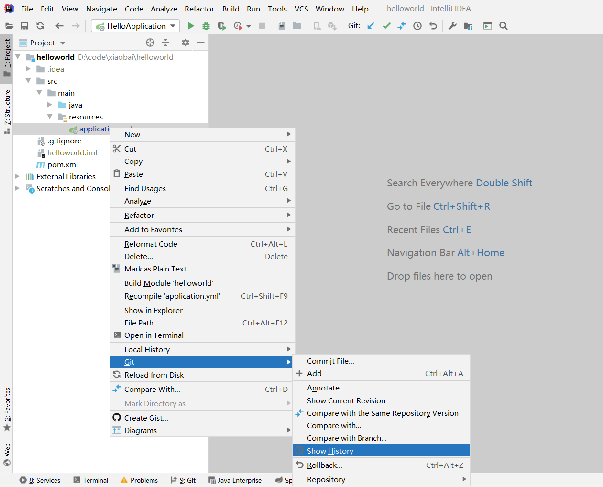
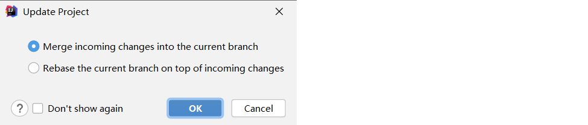
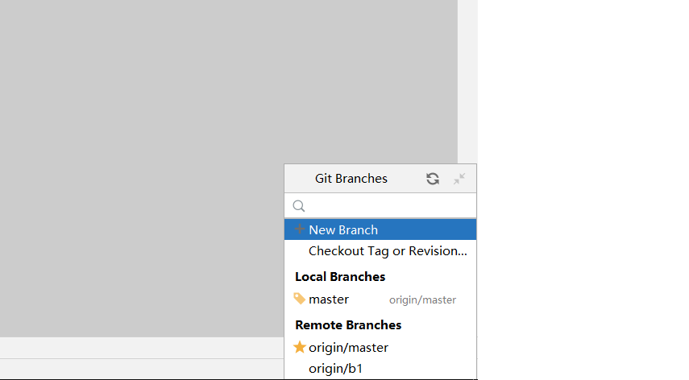

# Git笔记

* [1.版本控制（VCS）](#1版本控制（vcs）)
  * [1.1.概述](#11概述)
  * [1.2.版本控制优点](#12版本控制优点)
  * [1.3.本地版本控制系统（离线版）](#13本地版本控制系统离线版)
  * [1.4.集中化的版本控制系统（联网版）](#14集中化的版本控制系统联网版)
  * [1.5.分布式版本控制系统（离线+联网）](#15分布式版本控制系统离线联网)
* [2.Git](#2git)
  * [2.1.Git概述](#21git概述)
  * [2.2.Git基本工作流程](#22git基本工作流程)
  * [2.3.Git下载与安装](#23git下载与安装)
    * [2.3.1.下载](#231下载)
    * [2.3.2.Linux下安装Git](#232linux下安装git)
* [3.Git远程仓库托管](#3git远程仓库托管)
* [4.Git常用命令](#4git常用命令)
  * [4.1.初始化环境](#41初始化环境)
  * [4.2.创建仓库](#42创建仓库)
    * [4.2.1.自行创建本地仓库](#421自行创建本地仓库)
    * [4.2.2.从远程仓库clone到本地成为本地仓库](#422从远程仓库clone到本地成为本地仓库)
  * [4.3.工作目录，版本库，暂存区](#43工作目录版本库暂存区)
  * [4.4.文件四种状态及互相转换](#44文件四种状态及互相转换)
  * [4.5.查看关联的远程仓库](#45查看关联的远程仓库)
  * [4.6.关联远程仓库](#46关联远程仓库)
  * [4.7.抓取和拉取](#47抓取和拉取)
  * [4.8.编写忽略规则并上传](#48编写忽略规则并上传)
    * [4.8.1.编写忽略规则](#481编写忽略规则)
    * [4.8.2.上传文件夹](#482上传文件夹)
  * [4.9.Git分支](#49git分支)
    * [4.9.1.分支概述](#491分支概述)
    * [4.9.2.查看分支](#492查看分支)
    * [4.9.3.创建&切换&推送分支](#493创建切换推送分支)
    * [4.9.4.合并分支](#494合并分支)
* [5.IDEA中使用Git](#5idea中使用git)
  * [5.1.在IDEA中配置Git](#51在idea中配置git)
  * [5.2.获取Git仓库](#52获取git仓库)
    * [5.2.1.本地初始化仓库](#521本地初始化仓库)
    * [5.2.2.从远程仓库克隆](#522从远程仓库克隆)
  * [5.3.Git忽略文件](#53git忽略文件)
  * [5.4.本地仓库操作](#54本地仓库操作)
    * [5.4.1.将文件加入暂存区](#541将文件加入暂存区)
    * [5.4.2.将暂存区文件提交到版本库](#542将暂存区文件提交到版本库)
    * [5.4.3.查看日志](#543查看日志)
  * [5.5.远程仓库操作](#55远程仓库操作)
    * [5.5.1.查看远程仓库](#551查看远程仓库)
    * [5.5.2.添加远程仓库](#552添加远程仓库)
    * [5.5.3.推送至远程仓库](#553推送至远程仓库)
    * [5.5.4.从远程仓库拉取](#554从远程仓库拉取)
  * [5.6.分支操作](#56分支操作)
    * [5.6.1.查看分支](#561查看分支)
    * [5.6.2.创建分支](#562创建分支)
    * [5.6.3.切换分支](#563切换分支)
    * [5.6.4.将分支推送到远程仓库](#564将分支推送到远程仓库)
    * [5.6.5.合并分支](#565合并分支)

# 1.版本控制（VCS）

## 1.1.概述

版本控制是一种记录一个或者若干个文件内容变化，方便将来查看版本修订情况（历史记录）的系统，简称VCS（Version Control System）

## 1.2.版本控制优点

- 使用版本控制可以方便记录文件的修改版本；
- 回溯到任意历史状态；
- 方便查看文件的修改细节，定位具体修改位置；
- 即使文件被删除，也可以恢复到原始状态；

## 1.3.本地版本控制系统（离线版）


## 1.4.集中化的版本控制系统（联网版）

本地化的版本控制系统管理对本地文件版本控制比较方便，但是如果是多个不同系统上的开发者操作相同文件就很难进行版本控制了，因此衍生出CVCS（Centralized Version Control Ststems）：通过一个单一的服务器来统一管理，这个服务器上保存所有文件的修改记录，使不同的开发者都可以获得最新的文件或者提交修改，比如：SVN；


## 1.5.分布式版本控制系统（离线+联网）

对于CVCS，由于所有文件历史记录都在中央服务器保存，一旦中央服务器出现了故障而没有备份，那么所有的开发者都无法使用版本控制，就可能出现丢失历史记录的风险，因此需要分布式版本控制系统DVCS（Distributed Version Control System）：开发者（客户端）不只获取最新的文件，而且还要把整个代码仓库以及历史记录完整存储到本地，即使服务器出现故障，也可以从本地恢复，例如：**Git**


# 2.Git

## 2.1.Git概述

Git --- The stupid content tracker, 傻瓜内容跟踪器。Linus Torvalds 是这样给我们介绍 Git 的。

Git 是基于 Linux内核开发的版本控制工具。与常用的版本控制工具 CVS, Subversion 等不同，它采用了分布式版本库的方式，不必服务器端软件支持（wingeddevil注：这得分是用什么样的服务端，使用http协议或者git协议等不太一样。并且在push和pull的时候和服务器端还是有交互的。），使源代码的发布和交流极其方便。 Git 的速度很快，这对于诸如 Linux kernel 这样的大项目来说自然很重要。 Git 最为出色的是它的合并跟踪（merge tracing）能力。

实际上内核开发团队决定开始开发和使用 Git 来作为内核开发的版本控制系统的时候，世界开源社群的反对声音不少，最大的理由是 Git 太艰涩难懂，从 Git 的内部工作机制来说，的确是这样。但是随着开发的深入，Git 的正常使用都由一些友好的脚本命令来执行，使 Git 变得非常好用，即使是用来管理我们自己的开发项目，Git 都是一个友好，有力的工具。现在，越来越多的著名项目采用 Git 来管理项目开发.

作为开源自由原教旨主义项目，Git 没有对版本库的浏览和修改做任何的权限限制。

目前GIT已经可以在windows下使用，主要方法有二：msysgit和Cygwin。Cygwin和Linux使用方法类似，Windows版本的GIT提供了友好的GUI(图形界面)，安装后很快可以上手，不在此做大篇幅介绍。

本文将以 Git 官方文档 Tutorial， core-tutorial 和 Everyday GIT 作为蓝本翻译整理，但是暂时去掉了对 Git 内部工作机制的阐述，力求简明扼要，并加入了作者使用 Git 的过程中的一些心得体会，注意事项，以及更多的例子。建议你最好通过你所使用的 Unix / Linux 发行版的安装包来安装 Git, 你可以在线浏览本文 ，也可以通过下面的命令来得到本文最新的版本库，并且通过后面的学习用 Git 作为工具参加到本文的创作中来。

## 2.2.Git基本工作流程


- 从远程仓库中克隆代码到本地仓库
- 从本地仓库中checkout代码然后进行代码修改
- 在提交前先将代码提交到暂存区
- 提交到本地仓库。本地仓库中保存修改的各个历史版本
- 修改完成后，需要和团队成员共享代码时，将代码push到远程仓库

## 2.3.Git下载与安装

### 2.3.1.下载

Git有不同平台的版本，常用的主要是Linux版；

虽然有各种平台，但是都是通过git命令实现版本控制，即使有图形化界面版，底层本质上封装的依旧是git命令，所以重点是熟悉git常用的一些命令；

### 2.3.2.Linux下安装Git

```
#安装编译依赖
yum install -y curl-devel expat-devel gettext-devel openssl-devel zlib-devel gcc perl-ExtUtils-MakeMaker

#获取git压缩包
wget https://mirrors.edge.kernel.org/pub/software/scm/git/git-2.28.0.tar.gz

#然后再Home文件夹中找到git-2.28.0，可以剪切到自己想要的位置
#然后解压文件
tar -zxvf git-2.28.0.tar.gz

#进入到该文件夹
cd git-2.28.0/

#编译该文件
make prefix=/opt/git all
#这里编译后放到/opt/git文件中

#然后安装该文件
make prefix=/opt/git install
#这里安装后放到/opt/git文件中

#删除git的历史版本
yum -y remove git

#编辑环境变量
vim /etc/profile

#在文件尾部添加
GIT_HOME=/opt/git
PATH=$GIT_HOME/bin
export GIT_HOME 

#然后刷新环境变量
source /etc/profile

#验证安装是否成功
git --version
```

# 3.Git远程仓库托管

如何搭建Git远程仓库呢？一般借助互联网上提供的一些代码托管服务来实现，其中比较常用的有GitHub，码云，GitLab等。

GitHub是一个面向开源及私有软件项目的托管平台，该平台只使用了Git进行版本控制，所以教github；

码云是国内的一个代码托管平台，由于服务器在国内，所以相比于GitHub，从码云克隆代码的速度更快；

**创建远程仓库的流程直接上GitHub或者码云进行创建；**

# 4.Git常用命令

## 4.1.初始化环境

```
#用户信息配置，git每次提交都会使用这个配置信息
git config --global user.name "用户名"
git config --global user.email "电子邮箱"

#查看配置信息
git config --list
```

## 4.2.创建仓库

### 4.2.1.自行创建本地仓库

```
#创建一个本地文件夹
cd gitepo/

#进入本地文件夹
cd gitepo/

#初始化文件夹为本地仓库
git init
#创建成功
```

### 4.2.2.从远程仓库clone到本地成为本地仓库

```
#通过https进行克隆(以gitee为例)
git clone https://gitee.com/AntonyChengYing/AntonyCheng.git
```

这个clone命令不仅仅是将远程库的内容拷贝下来，而是拷贝下来之后对文件夹进行了一次`git clone`初始化操作；

## 4.3.工作目录，版本库，暂存区

- 工作目录（别名：工作区）：包含`.git`文件的目录就是工作目录，一般就是我们的工程目录；
- 版本库：名叫`.git`的目录，保存提交的数据，元素数据，日志等；
- 暂存区（别名：stage/索引）：是一个文件（`.git`目录下的`index`文件），保存下次将要提交的文件列表信息；


## 4.4.文件四种状态及互相转换

```
#查看文件状态
git status

#工作状态进入暂存状态，如果不写文件，那么就是默认全部，以下有此符号的均是
git add <文件>

#查看暂存区中的文件
git ls-files

#暂存状态退至工作状态
git restore --staged <文件>

#提交文件
git commit -m "提交信息" <文件>

#删除文件
git rm <文件>

#恢复删除的文件
#1.首先得把删除从从暂存状态退至工作状态
git restore --staged <文件>
#2.然后在对其进行恢复
git restore <文件>

#显示日志
git log
#显示的结果如下例
commit e95894d1cef72ecc93098c6af2c53b4885dde131 (HEAD -> master)

#还原操作，即还原日志里的操作，e958就是日志哈希码前四位
git reset --参数 e958
#参数有soft mixed hard，还原程度由轻到重
```

- 未跟踪状态（untracked）

  

- 未修改状态（unmodify）

- 已修改状态（modified）

  

- 已暂存状态（staged）

  

## 4.5.查看关联的远程仓库

```
#如果是从远程仓库clone的，下面的代码能够显示
git remote
#显示详细信息
git remote -v
#如果是手动创建的本地仓库，并且没有更改任何配置，那么上方的代码就无法显示内容
```


## 4.6.关联远程仓库

```
#如果是手动创建的本地仓库，初始化后需要关联一下远程仓库
git remote add 自定义关联名称（建议：origin） 仓库链接;
```


## 4.7.抓取和拉取

```
#抓取，仅仅是把文件抓取到版本库中
git fetch 关联名称 仓库分支
#如果想把文件抓到工作区，还需要对版本库进行合并
git merge 关联名称/仓库分支
```


```
#拉取，直接把文件拉取到工作区
git pull 关联名称 仓库分支
```


## 4.8.编写忽略规则并上传

### 4.8.1.编写忽略规则

**上传时我们应该忽略一些文件或者目录：**

- target目录
- test目录
- 日志文件

所以我们上传时需要编写忽略规则，该规则一般需要在工作区新建一个文件`.gitignore`，然后在里面编写规则；


常用规则如下：


maven工程使用的`.gitignore`规则：

```
#忽略target目录
target/

#忽略test目录
test/

#忽略日志文件
*.log
```

### 4.8.2.上传文件夹

```
#以下时git初始化并且准备好忽略规则后的事情
#首先得添加文件夹到暂存区，“.”表示所有文件
git add .

#其次检查一遍暂存区中的内容
git ls-files

#然后提交到版本库，这个代码上面有讲过
git commit -m "上传一个完整的文件夹"

#查看git日志，确保提交成功
git log

#在检查一遍该仓库是否关联远程仓库
git remote -v

#若关联上了就不管
#若没有关联上，则需要添加
git remote add 自定义关联名称（建议：origin） 仓库链接;

#关联上之后就进行上传即可，为了避免出错，这里可以直接强制push
git push 关联名称 仓库分支 -f
#此时就完成上传操作了，之后可能会遇到一些奇奇怪怪的报错，需要自行搜索一下
```


## 4.9.Git分支

### 4.9.1.分支概述

在对版本库进行最初的提交后，Git会默认建立一个名为master的分支，之后的提交在切换分支之前都会增加在master分支里。而且新建的分支会拷贝master分支，说白了就是新建分支是master分支的一个副本，而且被拷贝的分支并不只能是master分支，也可以是master分支的分支；

一旦我们修改完成对分支副本的修改，我们就将该分支和被拷贝分支进行合并即可；


### 4.9.2.查看分支

```
#查看本地仓库分支
git branch

#查看远程仓库分支
git branch -r

#查看所有的分支
git branch -a
```


**注："*"表示当前所在的本地仓库分支；**

### 4.9.3.创建&切换&推送分支

```
#创建本地分支，一定要注意创建分支时所在的分支，因为一旦创建，新分支就会拷贝所在分支
git branch 分支名

#切换本地分支
git checkout dev

#推送本地分支到远程仓库
git push 关联名称 被推送的分支名
```


### 4.9.4.合并分支

```
#分支合并，需要先切换到被拷贝的分支
git merge -m 合并信息 子分支名
```


但是合并分支并不是一帆风顺的，如果父分支中有文件或目录被修改，子分支中也有相同文件或目录被修改，那么合并的时候就会产生冲突，此时我们需要手动解决相关的冲突文件；

冲突报错如下：


冲突文件如下：


文件修改后如下（假设我们想以master分支为准）：


然后我们需要再次提交这个文件到版本库：

```
#先添加到缓存区
git add Test.txt

#再提交到版本库，此时不需要带有文件名，因为需要提交全部有问题的文件
git commit -m "解决了这个文件分支合并冲突问题"
```


因为解决的是主分支，所以子分支下的内容不会受到影响：


# 5.IDEA中使用Git

## 5.1.在IDEA中配置Git

在IDEA中使用Git，本质上还是使用的本地安装的Git软件，所以需要提前安装好Git并在IDEA中配置Git。

Git安装目录：


解释说明：

> git.exe：Git安装目录下的可执行文件，前面执行的git命令，其实就是执行的这个文件


IDEA中的配置：


说明：如果Git安装在默认目录中（C:\Program Files\Git），则IDEA中无需再手动配置，直接就可以使用。

## 5.2.获取Git仓库

在IDEA中获取Git仓库有两种方式：

- 本地初始化仓库，本质就是执行 git init 命令
- 从远程仓库克隆，本质就是执行 git clone 命令

### 5.2.1.本地初始化仓库

在IDEA中通过如下操作可以在本地初始化一个本地仓库，其实底层就是执行的 git init 命令。操作过程如下：

1）依次选择菜单【VCS】---【Import into Version Control】---【Create Git Repository】


2）在弹出的【Create Git Repository】对话框中选择当前项目根目录，点击【OK】按钮：


操作完成后可以看到当前项目根目录下出现了.git隐藏目录：


操作完成后可以在IDEA的工具栏中看到Git的相关操作图标：

### 5.2.2.从远程仓库克隆

在IDEA中从远程仓库克隆本质就是执行的 git clone 命令，具体操作过程如下：

1）在IDEA开始窗口中点击【Get from Version Control】


2）在弹出的【Get from Version Control】窗口中输入远程仓库的URL地址和对应的本地仓库存放目录，点击【Clone】按钮进行仓库克隆操作


## 5.3.Git忽略文件

在Git工作区中有一个特殊的文件 .gitignore，通过此文件可以指定工作区中的哪些文件不需要Git管理。我们在码云上创建Git远程仓库时可以指定生成此文件，如下：


创建完成后效果如下：


解释说明：

> 1）我们在使用Git管理项目代码时，并不是所有文件都需要Git管理，例如Java项目中编译的.class文件、开发工具自带的配置文件等，这些文件没有必要交给Git管理，所以也就不需要提交到Git版本库中
>
> 2）注意忽略文件的名称是固定的，不能修改
>
> 3）添加到忽略列表中的文件后续Git工具就会忽略它


一个参考的.gitignore文件内容如下：

~~~file
.git
logs
rebel.xml
target/
!.mvn/wrapper/maven-wrapper.jar
log.path_IS_UNDEFINED
.DS_Store
offline_user.md
*.class

### IntelliJ IDEA ###
.idea
*.iws
*.iml
*.ipr
~~~


## 5.4.本地仓库操作

本地仓库操作：

- 将文件加入暂存区，本质就是执行 git add 命令
- 将暂存区的文件提交到版本库，本质就是执行 git commit 命令
- 查看日志，本质就是执行 git log 命令

### 5.4.1.将文件加入暂存区

当在Git工作区新增文件或者对已有文件修改后，就需要将文件的修改加入暂存区，具体操作如下：


### 5.4.2.将暂存区文件提交到版本库

将暂存区文件提交到版本库，可以选择一个文件进行提交，也可以选择整个项目提交多个文件。在IEDA中对文件的提交进行了简化操作，也就是如果文件修改后，无需再加入暂存区，可以直接提交。

1）提交一个文件：


可以看到，如果选中一个文件提交，则菜单名称为【Commit File...】


2）提交多个文件：


可以看到，如果提交多个文件，则菜单名称为【Commit Directory...】


由于提交操作属于高频操作，所以为了进一步方便操作，在IDEA的工具栏中提供了提交操作的快捷按钮：


### 5.4.3.查看日志

查看日志，既可以查看整个仓库的提交日志，也可以查看某个文件的提交日志。

1）查看整个项目的提交日志：


2）查看某个文件的提交日志




## 5.5.远程仓库操作

远程仓库操作：

- 查看远程仓库，本质就是执行 git remote 命令
- 添加远程仓库，本质就是执行 git remote add 命令
- 推送至远程仓库，本质就是执行 git push 命令
- 从远程仓库拉取，本质就是执行 git pull 命令

### 5.5.1.查看远程仓库

操作过程如下：


在弹出的【Git Remotes】窗口中可以看到配置的远程仓库：


### 5.5.2.添加远程仓库

一个本地仓库可以配置多个远程仓库，在【Git Remotes】窗口中点击【+】来添加一个新的远程仓库：


### 5.5.3.推送至远程仓库

可以通过如下操作将本地仓库文件推送至远程仓库：


在弹出的【Push Commits】窗口中可以看到本次推送的文件，点击【Push】按钮即可推送至远程仓库：


由于推送至远程仓库操作属于高频操作，所以可以通过IDEA工具栏中的提交快捷按钮同时完成提交和推送：


点击【Commit and Push...】按钮同时完成提交和推送操作

### 5.5.4.从远程仓库拉取

可以通过如下操作从远程仓库拉取：


由于从远程仓库拉取文件属于高频操作，所以在IDEA的工具栏中提供了对应的快捷按钮：


在弹出的【Update Project】窗口中点击【OK】：




## 5.6.分支操作

分支操作：

- 查看分支，本质就是执行 git branch 命令
- 创建分支，本质就是执行 git branch 分支名 命令
- 切换分支，本质就是执行 git checkout 命令
- 将分支推送到远程仓库，本质就是执行 git push 命令
- 合并分支，本质就是执行 git merge 命令

### 5.6.1.查看分支

可以通过如下操作查看分支：


在弹出的窗口中可以看到本地分支和远程分支：


由于分支操作属于高频操作，所以在IDEA的状态栏中提供了分支操作的快捷按钮：


点击【master】快捷按钮即可弹出【Git Branches】分支窗口：




### 5.6.2.创建分支

在【Git Branches】分支窗口中点击【New Branch】，弹出如下窗口：


在弹出的【Create New Branch】窗口中输入新分支的名称，点击【Create】按钮完成分支创建

### 5.6.3.切换分支

通过如下操作可以切换分支：


### 5.6.4.将分支推送到远程仓库

通过如下操作可以将分支推送到远程仓库：


### 5.6.5.合并分支

通过下面操作可以进行分支的合并：


